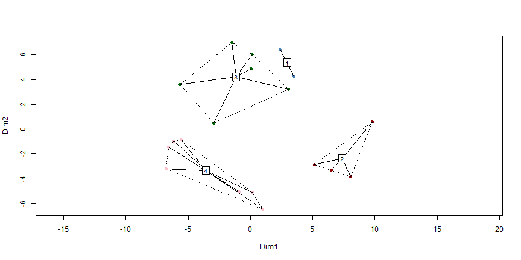

Session 3-4, Dimensionality Reduction and Derived Attributes (Technical Slides)
========================================================
title : Data Analytics for Business
author : T. Evgeniou, INSEAD


 What is Dimensionality Deduction and Factor Analysis?
========================================================

Derive new  variables which are (linear) combinations of the original ones and capture most of the information in the original data. 

Is often used as a first step in Data Analytics

Can also be used to solve multicollinearity issues in regression

Factor Analysis: Key idea
========================================================


1. Transform the original selected variables into a smaller set of factors

2. Understand the underlying structure of the data and the new factors

3. Use the factors for subsequent analysis


 Key Questions
========================================================

1. Can we really simplify the data by grouping the raw attributes?

2. How many factors should we use?

3. How good are the factors we found?

4. How interpretable and actionable are the factors we found? 

Dimensionality Reduction and Factor Analysis: 6 (Easy) Steps
========================================================

1. Confirm data is metric

2. Scale the  data

3. Check correlations

4. Choose number of factors 

5. Interpret the factors

6. Save factor scores

 Applying Factor Analysis: Evaluating MBA Applications
========================================================


package 'rpart.plot' successfully unpacked and MD5 sums checked
package 'ggdendro' successfully unpacked and MD5 sums checked
package 'gdata' successfully unpacked and MD5 sums checked
package 'gplots' successfully unpacked and MD5 sums checked
package 'ROCR' successfully unpacked and MD5 sums checked
package 'iterators' successfully unpacked and MD5 sums checked
package 'pkgmaker' successfully unpacked and MD5 sums checked
package 'registry' successfully unpacked and MD5 sums checked
package 'rngtools' successfully unpacked and MD5 sums checked
package 'gridBase' successfully unpacked and MD5 sums checked
package 'foreach' successfully unpacked and MD5 sums checked
package 'doParallel' successfully unpacked and MD5 sums checked
package 'NMF' successfully unpacked and MD5 sums checked
package 'irlba' successfully unpacked and MD5 sums checked
package 'igraph' successfully unpacked and MD5 sums checked
package 'networkD3' successfully unpacked and MD5 sums checked


Variables available:

* GPA
* GMAT score
* Scholarships, fellowships won
* Evidence of Communications skills 
* Prior Job Experience
* Organizational Experience
* Other extra curricular achievements

Which variables are correlated? What do these variables capture?

 Example Factors
========================================================

<style>
.wrapper{
height: 120%;
width: 900px;
overflow: auto;
}
</style>
<div class="wrapper" style="font-size:20px;">
<div class="row">
<div class="col-md-3">
<!-- Table generated in R 3.3.1 by googleVis 0.6.2 package -->
<!-- Thu Jan 12 11:12:12 2017 -->


<!-- jsHeader -->
<script type="text/javascript">
 
// jsData 
function gvisDataTableIDf84709f499d () {
var data = new google.visualization.DataTable();
var datajson =
[
 [
"GPA",
0.96,
-0.05
],
[
"GMAT",
0.95,
0.19
],
[
"Fellow",
0.95,
-0.01
],
[
"Comm",
0.7,
0.54
],
[
"Job.Ex",
0.19,
0.93
],
[
"Organze",
0.01,
0.89
],
[
"Extra",
0.01,
0.86
] 
];
data.addColumn('string','Variables');
data.addColumn('number','Component 1');
data.addColumn('number','Component 2');
data.addRows(datajson);
return(data);
}
 
// jsDrawChart
function drawChartTableIDf84709f499d() {
var data = gvisDataTableIDf84709f499d();
var options = {};
options["allowHtml"] = true;
options["showRowNumber"] = true;
options["width"] = 1220;
options["height"] = 400;
options["allowHTML"] = true;
options["page"] = "disable";

    var chart = new google.visualization.Table(
    document.getElementById('TableIDf84709f499d')
    );
    chart.draw(data,options);
    

}
  
 
// jsDisplayChart
(function() {
var pkgs = window.__gvisPackages = window.__gvisPackages || [];
var callbacks = window.__gvisCallbacks = window.__gvisCallbacks || [];
var chartid = "table";
  
// Manually see if chartid is in pkgs (not all browsers support Array.indexOf)
var i, newPackage = true;
for (i = 0; newPackage && i < pkgs.length; i++) {
if (pkgs[i] === chartid)
newPackage = false;
}
if (newPackage)
  pkgs.push(chartid);
  
// Add the drawChart function to the global list of callbacks
callbacks.push(drawChartTableIDf84709f499d);
})();
function displayChartTableIDf84709f499d() {
  var pkgs = window.__gvisPackages = window.__gvisPackages || [];
  var callbacks = window.__gvisCallbacks = window.__gvisCallbacks || [];
  window.clearTimeout(window.__gvisLoad);
  // The timeout is set to 100 because otherwise the container div we are
  // targeting might not be part of the document yet
  window.__gvisLoad = setTimeout(function() {
  var pkgCount = pkgs.length;
  google.load("visualization", "1", { packages:pkgs, callback: function() {
  if (pkgCount != pkgs.length) {
  // Race condition where another setTimeout call snuck in after us; if
  // that call added a package, we must not shift its callback
  return;
}
while (callbacks.length > 0)
callbacks.shift()();
} });
}, 100);
}
 
// jsFooter
</script>
 
<!-- jsChart -->  
<script type="text/javascript" src="https://www.google.com/jsapi?callback=displayChartTableIDf84709f499d"></script>
 
<!-- divChart -->
  
<div id="TableIDf84709f499d" 
  style="width: 1220; height: 400;">
</div>
</div>
</div>
</div>

 Step 1: Confirm data is metric
========================================================


<style>
.wrapper{
height: 120%;
width: 900px;
overflow: auto;
}
</style>
<div class="wrapper" style="font-size:20px;">
<div class="row">
<div class="col-md-3">
<!-- Table generated in R 3.3.1 by googleVis 0.6.2 package -->
<!-- Thu Jan 12 11:12:12 2017 -->


<!-- jsHeader -->
<script type="text/javascript">
 
// jsData 
function gvisDataTableIDf843fef6061 () {
var data = new google.visualization.DataTable();
var datajson =
[
 [
"1",
3,
580,
2,
3.5,
5,
3.8,
4
],
[
"2",
3.2,
570,
2,
3.8,
6,
3.8,
3.8
],
[
"3",
3.7,
690,
3,
3.3,
3,
3.2,
3.6
],
[
"4",
3.9,
760,
3,
3.8,
5,
3.9,
3.2
],
[
"5",
2.8,
480,
2,
3.2,
6,
3.8,
3.8
],
[
"6",
3.4,
520,
2.5,
2.6,
2,
2.5,
2.4
],
[
"7",
3.6,
670,
3,
3.7,
4,
3.5,
2.9
],
[
"8",
3.6,
760,
3,
3.9,
5,
3.3,
3.2
],
[
"9",
2.8,
380,
1,
2,
3,
2.9,
3.1
],
[
"10",
3.6,
560,
3,
2.8,
2,
1,
2.8
],
[
"11",
2.8,
480,
2,
3.2,
4,
3.4,
3.7
],
[
"12",
3.6,
590,
3.4,
3.4,
5,
3.7,
3.6
],
[
"13",
3.8,
720,
3.8,
3.8,
6,
3.8,
3.7
],
[
"14",
3.5,
680,
3,
3.6,
6,
3.4,
3.8
],
[
"15",
3.9,
700,
3.7,
3.8,
2,
2.1,
2.7
],
[
"16",
3.3,
560,
2.8,
3.4,
5,
3.8,
2.7
],
[
"17",
2.8,
440,
1,
3.3,
5,
3.5,
3.8
],
[
"18",
2.5,
430,
1,
3.1,
3,
3.1,
2.9
],
[
"19",
2.5,
420,
1,
2.8,
2,
2.3,
2.5
],
[
"20",
3.8,
680,
2.8,
3.7,
6,
3.2,
3.8
] 
];
data.addColumn('string','Variables');
data.addColumn('number','GPA');
data.addColumn('number','GMAT');
data.addColumn('number','Fellow');
data.addColumn('number','Comm');
data.addColumn('number','Job.Ex');
data.addColumn('number','Organze');
data.addColumn('number','Extra');
data.addRows(datajson);
return(data);
}
 
// jsDrawChart
function drawChartTableIDf843fef6061() {
var data = gvisDataTableIDf843fef6061();
var options = {};
options["allowHtml"] = true;
options["showRowNumber"] = true;
options["width"] = 1220;
options["height"] = 400;
options["allowHTML"] = true;
options["page"] = "disable";

    var chart = new google.visualization.Table(
    document.getElementById('TableIDf843fef6061')
    );
    chart.draw(data,options);
    

}
  
 
// jsDisplayChart
(function() {
var pkgs = window.__gvisPackages = window.__gvisPackages || [];
var callbacks = window.__gvisCallbacks = window.__gvisCallbacks || [];
var chartid = "table";
  
// Manually see if chartid is in pkgs (not all browsers support Array.indexOf)
var i, newPackage = true;
for (i = 0; newPackage && i < pkgs.length; i++) {
if (pkgs[i] === chartid)
newPackage = false;
}
if (newPackage)
  pkgs.push(chartid);
  
// Add the drawChart function to the global list of callbacks
callbacks.push(drawChartTableIDf843fef6061);
})();
function displayChartTableIDf843fef6061() {
  var pkgs = window.__gvisPackages = window.__gvisPackages || [];
  var callbacks = window.__gvisCallbacks = window.__gvisCallbacks || [];
  window.clearTimeout(window.__gvisLoad);
  // The timeout is set to 100 because otherwise the container div we are
  // targeting might not be part of the document yet
  window.__gvisLoad = setTimeout(function() {
  var pkgCount = pkgs.length;
  google.load("visualization", "1", { packages:pkgs, callback: function() {
  if (pkgCount != pkgs.length) {
  // Race condition where another setTimeout call snuck in after us; if
  // that call added a package, we must not shift its callback
  return;
}
while (callbacks.length > 0)
callbacks.shift()();
} });
}, 100);
}
 
// jsFooter
</script>
 
<!-- jsChart -->  
<script type="text/javascript" src="https://www.google.com/jsapi?callback=displayChartTableIDf843fef6061"></script>
 
<!-- divChart -->
  
<div id="TableIDf843fef6061" 
  style="width: 1220; height: 400;">
</div>
</div>
</div>
</div>

Step 2: Scale the  data
========================================================

<style>
.wrapper{
height: 120%;
width: 900px;
overflow: auto;
}
</style>
<div class="wrapper" style="font-size:20px;">
<div class="row">
<div class="col-md-3">
<!-- Table generated in R 3.3.1 by googleVis 0.6.2 package -->
<!-- Thu Jan 12 11:12:12 2017 -->


<!-- jsHeader -->
<script type="text/javascript">
 
// jsData 
function gvisDataTableIDf8425221c55 () {
var data = new google.visualization.DataTable();
var datajson =
[
 [
"GPA",
2.5,
2.8,
3.45,
3.31,
3.62,
3.9,
0.47
],
[
"GMAT",
380,
480,
575,
583.5,
682.5,
760,
119.44
],
[
"Fellow",
1,
2,
2.8,
2.45,
3,
3.8,
0.91
],
[
"Comm",
2,
3.18,
3.4,
3.34,
3.73,
3.9,
0.49
],
[
"Job.Ex",
2,
3,
5,
4.25,
5.25,
6,
1.52
],
[
"Organze",
1,
3.05,
3.4,
3.2,
3.8,
3.9,
0.73
],
[
"Extra",
2.4,
2.88,
3.4,
3.3,
3.8,
4,
0.52
] 
];
data.addColumn('string','Variables');
data.addColumn('number','min');
data.addColumn('number','X25.percent');
data.addColumn('number','median');
data.addColumn('number','mean');
data.addColumn('number','X75.percent');
data.addColumn('number','max');
data.addColumn('number','std');
data.addRows(datajson);
return(data);
}
 
// jsDrawChart
function drawChartTableIDf8425221c55() {
var data = gvisDataTableIDf8425221c55();
var options = {};
options["allowHtml"] = true;
options["showRowNumber"] = true;
options["width"] = 1220;
options["height"] = 400;
options["allowHTML"] = true;
options["page"] = "disable";

    var chart = new google.visualization.Table(
    document.getElementById('TableIDf8425221c55')
    );
    chart.draw(data,options);
    

}
  
 
// jsDisplayChart
(function() {
var pkgs = window.__gvisPackages = window.__gvisPackages || [];
var callbacks = window.__gvisCallbacks = window.__gvisCallbacks || [];
var chartid = "table";
  
// Manually see if chartid is in pkgs (not all browsers support Array.indexOf)
var i, newPackage = true;
for (i = 0; newPackage && i < pkgs.length; i++) {
if (pkgs[i] === chartid)
newPackage = false;
}
if (newPackage)
  pkgs.push(chartid);
  
// Add the drawChart function to the global list of callbacks
callbacks.push(drawChartTableIDf8425221c55);
})();
function displayChartTableIDf8425221c55() {
  var pkgs = window.__gvisPackages = window.__gvisPackages || [];
  var callbacks = window.__gvisCallbacks = window.__gvisCallbacks || [];
  window.clearTimeout(window.__gvisLoad);
  // The timeout is set to 100 because otherwise the container div we are
  // targeting might not be part of the document yet
  window.__gvisLoad = setTimeout(function() {
  var pkgCount = pkgs.length;
  google.load("visualization", "1", { packages:pkgs, callback: function() {
  if (pkgCount != pkgs.length) {
  // Race condition where another setTimeout call snuck in after us; if
  // that call added a package, we must not shift its callback
  return;
}
while (callbacks.length > 0)
callbacks.shift()();
} });
}, 100);
}
 
// jsFooter
</script>
 
<!-- jsChart -->  
<script type="text/javascript" src="https://www.google.com/jsapi?callback=displayChartTableIDf8425221c55"></script>
 
<!-- divChart -->
  
<div id="TableIDf8425221c55" 
  style="width: 1220; height: 400;">
</div>
</div>
</div>
</div>


Data Standardization: Example Code
========================================================


```r
ProjectDatafactor_scaled=apply(ProjectDataFactor,2, function(r) {
  if (sd(r)!=0) { 
    res=(r-mean(r))/sd(r) 
    } else { 
      res=0*r; res
      }
  })
```

 Standardized Data: Summary Statistics
========================================================

<style>
.wrapper{
height: 120%;
width: 900px;
overflow: auto;
}
</style>
<div class="wrapper" style="font-size:20px;">
<div class="row">
<div class="col-md-3">
<!-- Table generated in R 3.3.1 by googleVis 0.6.2 package -->
<!-- Thu Jan 12 11:12:12 2017 -->


<!-- jsHeader -->
<script type="text/javascript">
 
// jsData 
function gvisDataTableIDf8427f262b4 () {
var data = new google.visualization.DataTable();
var datajson =
[
 [
"GPA",
-1.72,
-1.08,
0.31,
0,
0.68,
1.27,
1
],
[
"GMAT",
-1.7,
-0.87,
-0.07,
0,
0.83,
1.48,
1
],
[
"Fellow",
-1.6,
-0.5,
0.39,
0,
0.61,
1.49,
1
],
[
"Comm",
-2.73,
-0.33,
0.13,
0,
0.8,
1.16,
1
],
[
"Job.Ex",
-1.48,
-0.82,
0.49,
0,
0.66,
1.15,
1
],
[
"Organze",
-2.99,
-0.2,
0.27,
0,
0.82,
0.95,
1
],
[
"Extra",
-1.75,
-0.83,
0.19,
0,
0.97,
1.36,
1
] 
];
data.addColumn('string','Variables');
data.addColumn('number','min');
data.addColumn('number','X25.percent');
data.addColumn('number','median');
data.addColumn('number','mean');
data.addColumn('number','X75.percent');
data.addColumn('number','max');
data.addColumn('number','std');
data.addRows(datajson);
return(data);
}
 
// jsDrawChart
function drawChartTableIDf8427f262b4() {
var data = gvisDataTableIDf8427f262b4();
var options = {};
options["allowHtml"] = true;
options["showRowNumber"] = true;
options["width"] = 1220;
options["height"] = 400;
options["allowHTML"] = true;
options["page"] = "disable";

    var chart = new google.visualization.Table(
    document.getElementById('TableIDf8427f262b4')
    );
    chart.draw(data,options);
    

}
  
 
// jsDisplayChart
(function() {
var pkgs = window.__gvisPackages = window.__gvisPackages || [];
var callbacks = window.__gvisCallbacks = window.__gvisCallbacks || [];
var chartid = "table";
  
// Manually see if chartid is in pkgs (not all browsers support Array.indexOf)
var i, newPackage = true;
for (i = 0; newPackage && i < pkgs.length; i++) {
if (pkgs[i] === chartid)
newPackage = false;
}
if (newPackage)
  pkgs.push(chartid);
  
// Add the drawChart function to the global list of callbacks
callbacks.push(drawChartTableIDf8427f262b4);
})();
function displayChartTableIDf8427f262b4() {
  var pkgs = window.__gvisPackages = window.__gvisPackages || [];
  var callbacks = window.__gvisCallbacks = window.__gvisCallbacks || [];
  window.clearTimeout(window.__gvisLoad);
  // The timeout is set to 100 because otherwise the container div we are
  // targeting might not be part of the document yet
  window.__gvisLoad = setTimeout(function() {
  var pkgCount = pkgs.length;
  google.load("visualization", "1", { packages:pkgs, callback: function() {
  if (pkgCount != pkgs.length) {
  // Race condition where another setTimeout call snuck in after us; if
  // that call added a package, we must not shift its callback
  return;
}
while (callbacks.length > 0)
callbacks.shift()();
} });
}, 100);
}
 
// jsFooter
</script>
 
<!-- jsChart -->  
<script type="text/javascript" src="https://www.google.com/jsapi?callback=displayChartTableIDf8427f262b4"></script>
 
<!-- divChart -->
  
<div id="TableIDf8427f262b4" 
  style="width: 1220; height: 400;">
</div>
</div>
</div>
</div>

 Step 3:  Check correlations 
========================================================

<style>
.wrapper{
height: 120%;
width: 900px;
overflow: auto;
}
</style>
<div class="wrapper" style="font-size:20px;">
<div class="row">
<div class="col-md-3">
<!-- Table generated in R 3.3.1 by googleVis 0.6.2 package -->
<!-- Thu Jan 12 11:12:12 2017 -->


<!-- jsHeader -->
<script type="text/javascript">
 
// jsData 
function gvisDataTableIDf847bda54e5 () {
var data = new google.visualization.DataTable();
var datajson =
[
 [
1,
0.9,
0.92,
0.56,
0.15,
-0.03,
0.01
],
[
0.9,
1,
0.86,
0.78,
0.33,
0.19,
0.16
],
[
0.92,
0.86,
1,
0.59,
0.18,
0.01,
0.02
],
[
0.56,
0.78,
0.59,
1,
0.6,
0.47,
0.39
],
[
0.15,
0.33,
0.18,
0.6,
1,
0.8,
0.77
],
[
-0.03,
0.19,
0.01,
0.47,
0.8,
1,
0.61
],
[
0.01,
0.16,
0.02,
0.39,
0.77,
0.61,
1
] 
];
data.addColumn('number','GPA');
data.addColumn('number','GMAT');
data.addColumn('number','Fellow');
data.addColumn('number','Comm');
data.addColumn('number','Job.Ex');
data.addColumn('number','Organze');
data.addColumn('number','Extra');
data.addRows(datajson);
return(data);
}
 
// jsDrawChart
function drawChartTableIDf847bda54e5() {
var data = gvisDataTableIDf847bda54e5();
var options = {};
options["allowHtml"] = true;
options["width"] = 1920;
options["height"] = 216;
options["allowHTML"] = true;

    var chart = new google.visualization.Table(
    document.getElementById('TableIDf847bda54e5')
    );
    chart.draw(data,options);
    

}
  
 
// jsDisplayChart
(function() {
var pkgs = window.__gvisPackages = window.__gvisPackages || [];
var callbacks = window.__gvisCallbacks = window.__gvisCallbacks || [];
var chartid = "table";
  
// Manually see if chartid is in pkgs (not all browsers support Array.indexOf)
var i, newPackage = true;
for (i = 0; newPackage && i < pkgs.length; i++) {
if (pkgs[i] === chartid)
newPackage = false;
}
if (newPackage)
  pkgs.push(chartid);
  
// Add the drawChart function to the global list of callbacks
callbacks.push(drawChartTableIDf847bda54e5);
})();
function displayChartTableIDf847bda54e5() {
  var pkgs = window.__gvisPackages = window.__gvisPackages || [];
  var callbacks = window.__gvisCallbacks = window.__gvisCallbacks || [];
  window.clearTimeout(window.__gvisLoad);
  // The timeout is set to 100 because otherwise the container div we are
  // targeting might not be part of the document yet
  window.__gvisLoad = setTimeout(function() {
  var pkgCount = pkgs.length;
  google.load("visualization", "1", { packages:pkgs, callback: function() {
  if (pkgCount != pkgs.length) {
  // Race condition where another setTimeout call snuck in after us; if
  // that call added a package, we must not shift its callback
  return;
}
while (callbacks.length > 0)
callbacks.shift()();
} });
}, 100);
}
 
// jsFooter
</script>
 
<!-- jsChart -->  
<script type="text/javascript" src="https://www.google.com/jsapi?callback=displayChartTableIDf847bda54e5"></script>
 
<!-- divChart -->
  
<div id="TableIDf847bda54e5" 
  style="width: 1920; height: 216;">
</div>
</div>
</div>
</div>

 Step 4. Choose number of factors 
========================================================

For the method considered here (Principal Component Analysis):
* If there are n variables we will have n factors in total
* First factor will explain most of the variance, second next and so on.

Eigenvalues and Variance Explained by Factors
* each factor will have an associated eigenvalue -  which corresponds to the amount of variance explained by that factor
* with standardized variables each variable has a variance of 1, and the sum of all eigenvalues with n raw attributes is n
* we would like to capture as much of the total variance as possible, while keeping as few factors as possible

 How Many Factors? Eigenvalues and Variance Explained
========================================================


<br>
<style>
.wrapper{
height: 120%;
width: 900px;
overflow: auto;
}
</style>
<div class="wrapper" style="font-size:20px;">
<div class="row">
<div class="col-md-3">
<!-- Table generated in R 3.3.1 by googleVis 0.6.2 package -->
<!-- Thu Jan 12 11:12:12 2017 -->


<!-- jsHeader -->
<script type="text/javascript">
 
// jsData 
function gvisDataTableIDf8423fc2c1c () {
var data = new google.visualization.DataTable();
var datajson =
[
 [
"Component No:1",
3.743590932,
53.47987046,
53.47987046
],
[
"Component No:2",
2.267883829,
32.39834042,
85.87821088
],
[
"Component No:3",
0.4248511117,
6.069301595,
91.94751247
],
[
"Component No:4",
0.2879014132,
4.112877331,
96.0603898
],
[
"Component No:5",
0.1395511834,
1.993588334,
98.05397814
],
[
"Component No:6",
0.09841835557,
1.405976508,
99.45995465
],
[
"Component No:7",
0.0378031747,
0.5400453529,
100
] 
];
data.addColumn('string','Components');
data.addColumn('number','Eigenvalue');
data.addColumn('number','Percentage_of_explained_variance');
data.addColumn('number','Cumulative_percentage_of_explained_variance');
data.addRows(datajson);
return(data);
}
 
// jsDrawChart
function drawChartTableIDf8423fc2c1c() {
var data = gvisDataTableIDf8423fc2c1c();
var options = {};
options["allowHtml"] = true;
options["width"] = 1200;
options["height"] = 400;
options["allowHTML"] = true;
options["page"] = "disable";

  var dataFormat1 = new google.visualization.NumberFormat({pattern:"#.##"});
  dataFormat1.format(data, 1);
  var dataFormat2 = new google.visualization.NumberFormat({pattern:"#.##"});
  dataFormat2.format(data, 2);
  var dataFormat3 = new google.visualization.NumberFormat({pattern:"#.##"});
  dataFormat3.format(data, 3);

    var chart = new google.visualization.Table(
    document.getElementById('TableIDf8423fc2c1c')
    );
    chart.draw(data,options);
    

}
  
 
// jsDisplayChart
(function() {
var pkgs = window.__gvisPackages = window.__gvisPackages || [];
var callbacks = window.__gvisCallbacks = window.__gvisCallbacks || [];
var chartid = "table";
  
// Manually see if chartid is in pkgs (not all browsers support Array.indexOf)
var i, newPackage = true;
for (i = 0; newPackage && i < pkgs.length; i++) {
if (pkgs[i] === chartid)
newPackage = false;
}
if (newPackage)
  pkgs.push(chartid);
  
// Add the drawChart function to the global list of callbacks
callbacks.push(drawChartTableIDf8423fc2c1c);
})();
function displayChartTableIDf8423fc2c1c() {
  var pkgs = window.__gvisPackages = window.__gvisPackages || [];
  var callbacks = window.__gvisCallbacks = window.__gvisCallbacks || [];
  window.clearTimeout(window.__gvisLoad);
  // The timeout is set to 100 because otherwise the container div we are
  // targeting might not be part of the document yet
  window.__gvisLoad = setTimeout(function() {
  var pkgCount = pkgs.length;
  google.load("visualization", "1", { packages:pkgs, callback: function() {
  if (pkgCount != pkgs.length) {
  // Race condition where another setTimeout call snuck in after us; if
  // that call added a package, we must not shift its callback
  return;
}
while (callbacks.length > 0)
callbacks.shift()();
} });
}, 100);
}
 
// jsFooter
</script>
 
<!-- jsChart -->  
<script type="text/javascript" src="https://www.google.com/jsapi?callback=displayChartTableIDf8423fc2c1c"></script>
 
<!-- divChart -->
  
<div id="TableIDf8423fc2c1c" 
  style="width: 1200; height: 400;">
</div>
</div>
</div>
</div>

 How Many Factors? Scree Plot
========================================================

<!-- LineChart generated in R 3.3.1 by googleVis 0.6.2 package -->
<!-- Thu Jan 12 11:12:12 2017 -->


<!-- jsHeader -->
<script type="text/javascript">
 
// jsData 
function gvisDataLineChartIDf8447d4de0 () {
var data = new google.visualization.DataTable();
var datajson =
[
 [
"1",
3.743590932,
1
],
[
"2",
2.267883829,
1
],
[
"3",
0.4248511117,
1
],
[
"4",
0.2879014132,
1
],
[
"5",
0.1395511834,
1
],
[
"6",
0.09841835557,
1
],
[
"7",
0.0378031747,
1
] 
];
data.addColumn('string','components');
data.addColumn('number','eigenvalues');
data.addColumn('number','abline');
data.addRows(datajson);
return(data);
}
 
// jsDrawChart
function drawChartLineChartIDf8447d4de0() {
var data = gvisDataLineChartIDf8447d4de0();
var options = {};
options["allowHtml"] = true;
options["title"] = "Scree plot";
options["legend"] = "right";
options["width"] = 900;
options["height"] = 500;
options["hAxis"] = {title:'Number of Components', titleTextStyle:{color:'black'}};
options["vAxes"] = [{title:'Eigenvalues'}];
options["series"] = [{color:'green',pointSize:3, targetAxisIndex: 0}];

    var chart = new google.visualization.LineChart(
    document.getElementById('LineChartIDf8447d4de0')
    );
    chart.draw(data,options);
    

}
  
 
// jsDisplayChart
(function() {
var pkgs = window.__gvisPackages = window.__gvisPackages || [];
var callbacks = window.__gvisCallbacks = window.__gvisCallbacks || [];
var chartid = "corechart";
  
// Manually see if chartid is in pkgs (not all browsers support Array.indexOf)
var i, newPackage = true;
for (i = 0; newPackage && i < pkgs.length; i++) {
if (pkgs[i] === chartid)
newPackage = false;
}
if (newPackage)
  pkgs.push(chartid);
  
// Add the drawChart function to the global list of callbacks
callbacks.push(drawChartLineChartIDf8447d4de0);
})();
function displayChartLineChartIDf8447d4de0() {
  var pkgs = window.__gvisPackages = window.__gvisPackages || [];
  var callbacks = window.__gvisCallbacks = window.__gvisCallbacks || [];
  window.clearTimeout(window.__gvisLoad);
  // The timeout is set to 100 because otherwise the container div we are
  // targeting might not be part of the document yet
  window.__gvisLoad = setTimeout(function() {
  var pkgCount = pkgs.length;
  google.load("visualization", "1", { packages:pkgs, callback: function() {
  if (pkgCount != pkgs.length) {
  // Race condition where another setTimeout call snuck in after us; if
  // that call added a package, we must not shift its callback
  return;
}
while (callbacks.length > 0)
callbacks.shift()();
} });
}, 100);
}
 
// jsFooter
</script>
 
<!-- jsChart -->  
<script type="text/javascript" src="https://www.google.com/jsapi?callback=displayChartLineChartIDf8447d4de0"></script>
 
<!-- divChart -->
  
<div id="LineChartIDf8447d4de0" 
  style="width: 900; height: 500;">
</div>


How many factors?
========================================================

Three criteria to use:

* Eigenvalue > 1
* Cumulative variance explained
* "Elbow" in the Scree plot

Using the eigenvalue criterion we select 2 factors. 

 Step 5. Interpret the factors
========================================================

Rotated Selected Factors using the varimax rotation.

<style>
.wrapper{
height: 120%;
width: 900px;
overflow: auto;
}
</style>
<div class="wrapper" style="font-size:20px;">
<div class="row">
<div class="col-md-3">
<!-- Table generated in R 3.3.1 by googleVis 0.6.2 package -->
<!-- Thu Jan 12 11:12:12 2017 -->


<!-- jsHeader -->
<script type="text/javascript">
 
// jsData 
function gvisDataTableIDf8433479c7 () {
var data = new google.visualization.DataTable();
var datajson =
[
 [
"GPA",
0.96,
-0.05
],
[
"GMAT",
0.95,
0.19
],
[
"Fellow",
0.95,
-0.01
],
[
"Comm",
0.7,
0.54
],
[
"Job.Ex",
0.19,
0.93
],
[
"Organze",
0.01,
0.89
],
[
"Extra",
0.01,
0.86
] 
];
data.addColumn('string','Variables');
data.addColumn('number','Component 1');
data.addColumn('number','Component 2');
data.addRows(datajson);
return(data);
}
 
// jsDrawChart
function drawChartTableIDf8433479c7() {
var data = gvisDataTableIDf8433479c7();
var options = {};
options["allowHtml"] = true;
options["showRowNumber"] = true;
options["width"] = 1220;
options["height"] = 400;
options["allowHTML"] = true;
options["page"] = "disable";

    var chart = new google.visualization.Table(
    document.getElementById('TableIDf8433479c7')
    );
    chart.draw(data,options);
    

}
  
 
// jsDisplayChart
(function() {
var pkgs = window.__gvisPackages = window.__gvisPackages || [];
var callbacks = window.__gvisCallbacks = window.__gvisCallbacks || [];
var chartid = "table";
  
// Manually see if chartid is in pkgs (not all browsers support Array.indexOf)
var i, newPackage = true;
for (i = 0; newPackage && i < pkgs.length; i++) {
if (pkgs[i] === chartid)
newPackage = false;
}
if (newPackage)
  pkgs.push(chartid);
  
// Add the drawChart function to the global list of callbacks
callbacks.push(drawChartTableIDf8433479c7);
})();
function displayChartTableIDf8433479c7() {
  var pkgs = window.__gvisPackages = window.__gvisPackages || [];
  var callbacks = window.__gvisCallbacks = window.__gvisCallbacks || [];
  window.clearTimeout(window.__gvisLoad);
  // The timeout is set to 100 because otherwise the container div we are
  // targeting might not be part of the document yet
  window.__gvisLoad = setTimeout(function() {
  var pkgCount = pkgs.length;
  google.load("visualization", "1", { packages:pkgs, callback: function() {
  if (pkgCount != pkgs.length) {
  // Race condition where another setTimeout call snuck in after us; if
  // that call added a package, we must not shift its callback
  return;
}
while (callbacks.length > 0)
callbacks.shift()();
} });
}, 100);
}
 
// jsFooter
</script>
 
<!-- jsChart -->  
<script type="text/javascript" src="https://www.google.com/jsapi?callback=displayChartTableIDf8433479c7"></script>
 
<!-- divChart -->
  
<div id="TableIDf8433479c7" 
  style="width: 1220; height: 400;">
</div>
</div>
</div>
</div>

 For visualization, let's supress the small numbers...
========================================================

<br>

<style>
.wrapper{
height: 120%;
width: 900px;
overflow: auto;
}
</style>
<div class="wrapper" style="font-size:20px;">
<div class="row">
<div class="col-md-3">
<!-- Table generated in R 3.3.1 by googleVis 0.6.2 package -->
<!-- Thu Jan 12 11:12:12 2017 -->


<!-- jsHeader -->
<script type="text/javascript">
 
// jsData 
function gvisDataTableIDf84154a661c () {
var data = new google.visualization.DataTable();
var datajson =
[
 [
"GPA",
0.96,
null
],
[
"GMAT",
0.95,
null
],
[
"Fellow",
0.95,
null
],
[
"Comm",
0.7,
0.54
],
[
"Job.Ex",
null,
0.93
],
[
"Organze",
null,
0.89
],
[
"Extra",
null,
0.86
] 
];
data.addColumn('string','Variables');
data.addColumn('number','Component 1');
data.addColumn('number','Component 2');
data.addRows(datajson);
return(data);
}
 
// jsDrawChart
function drawChartTableIDf84154a661c() {
var data = gvisDataTableIDf84154a661c();
var options = {};
options["allowHtml"] = true;
options["showRowNumber"] = true;
options["width"] = 1220;
options["height"] = 400;
options["allowHTML"] = true;
options["page"] = "disable";

    var chart = new google.visualization.Table(
    document.getElementById('TableIDf84154a661c')
    );
    chart.draw(data,options);
    

}
  
 
// jsDisplayChart
(function() {
var pkgs = window.__gvisPackages = window.__gvisPackages || [];
var callbacks = window.__gvisCallbacks = window.__gvisCallbacks || [];
var chartid = "table";
  
// Manually see if chartid is in pkgs (not all browsers support Array.indexOf)
var i, newPackage = true;
for (i = 0; newPackage && i < pkgs.length; i++) {
if (pkgs[i] === chartid)
newPackage = false;
}
if (newPackage)
  pkgs.push(chartid);
  
// Add the drawChart function to the global list of callbacks
callbacks.push(drawChartTableIDf84154a661c);
})();
function displayChartTableIDf84154a661c() {
  var pkgs = window.__gvisPackages = window.__gvisPackages || [];
  var callbacks = window.__gvisCallbacks = window.__gvisCallbacks || [];
  window.clearTimeout(window.__gvisLoad);
  // The timeout is set to 100 because otherwise the container div we are
  // targeting might not be part of the document yet
  window.__gvisLoad = setTimeout(function() {
  var pkgCount = pkgs.length;
  google.load("visualization", "1", { packages:pkgs, callback: function() {
  if (pkgCount != pkgs.length) {
  // Race condition where another setTimeout call snuck in after us; if
  // that call added a package, we must not shift its callback
  return;
}
while (callbacks.length > 0)
callbacks.shift()();
} });
}, 100);
}
 
// jsFooter
</script>
 
<!-- jsChart -->  
<script type="text/javascript" src="https://www.google.com/jsapi?callback=displayChartTableIDf84154a661c"></script>
 
<!-- divChart -->
  
<div id="TableIDf84154a661c" 
  style="width: 1220; height: 400;">
</div>
</div>
</div>
</div>

 What Factor Loads "Look Good"? Three Technical Quality Criteria
========================================================

1. For each factor (column) only a few loadings are large (in absolute value)

2. For each raw attribute (row) only a few loadings are large (in absolute value)

3. Any pair of factors (columns) should have different "patterns" of loading

 Step 6. Save factor scores 
========================================================

<br>

<style>
.wrapper{
height: 120%;
width: 900px;
overflow: auto;
}
</style>
<div class="wrapper" style="font-size:20px;">
<div class="row">
<div class="col-md-3">
<!-- Table generated in R 3.3.1 by googleVis 0.6.2 package -->
<!-- Thu Jan 12 11:12:12 2017 -->


<!-- jsHeader -->
<script type="text/javascript">
 
// jsData 
function gvisDataTableIDf8474b1754c () {
var data = new google.visualization.DataTable();
var datajson =
[
 [
"1",
-0.46,
1.05
],
[
"2",
-0.23,
1.21
],
[
"3",
0.68,
-0.24
],
[
"4",
1.13,
0.4
],
[
"5",
-0.94,
1.1
],
[
"6",
-0.14,
-1.67
],
[
"7",
0.76,
-0.17
],
[
"8",
1.02,
0.21
],
[
"9",
-1.76,
-0.72
],
[
"10",
0.43,
-2.14
],
[
"11",
-0.87,
0.4
],
[
"12",
0.47,
0.47
],
[
"13",
1.17,
0.85
],
[
"14",
0.55,
0.8
],
[
"15",
1.49,
-1.5
],
[
"16",
0.1,
0.06
],
[
"17",
-1.3,
0.86
],
[
"18",
-1.43,
-0.36
],
[
"19",
-1.42,
-1.31
],
[
"20",
0.74,
0.69
] 
];
data.addColumn('string','Observation');
data.addColumn('number','Derived Variable (Factor) 1');
data.addColumn('number','Derived Variable (Factor) 2');
data.addRows(datajson);
return(data);
}
 
// jsDrawChart
function drawChartTableIDf8474b1754c() {
var data = gvisDataTableIDf8474b1754c();
var options = {};
options["allowHtml"] = true;
options["showRowNumber"] = true;
options["width"] = 1220;
options["height"] = 400;
options["allowHTML"] = true;
options["page"] = "disable";

    var chart = new google.visualization.Table(
    document.getElementById('TableIDf8474b1754c')
    );
    chart.draw(data,options);
    

}
  
 
// jsDisplayChart
(function() {
var pkgs = window.__gvisPackages = window.__gvisPackages || [];
var callbacks = window.__gvisCallbacks = window.__gvisCallbacks || [];
var chartid = "table";
  
// Manually see if chartid is in pkgs (not all browsers support Array.indexOf)
var i, newPackage = true;
for (i = 0; newPackage && i < pkgs.length; i++) {
if (pkgs[i] === chartid)
newPackage = false;
}
if (newPackage)
  pkgs.push(chartid);
  
// Add the drawChart function to the global list of callbacks
callbacks.push(drawChartTableIDf8474b1754c);
})();
function displayChartTableIDf8474b1754c() {
  var pkgs = window.__gvisPackages = window.__gvisPackages || [];
  var callbacks = window.__gvisCallbacks = window.__gvisCallbacks || [];
  window.clearTimeout(window.__gvisLoad);
  // The timeout is set to 100 because otherwise the container div we are
  // targeting might not be part of the document yet
  window.__gvisLoad = setTimeout(function() {
  var pkgCount = pkgs.length;
  google.load("visualization", "1", { packages:pkgs, callback: function() {
  if (pkgCount != pkgs.length) {
  // Race condition where another setTimeout call snuck in after us; if
  // that call added a package, we must not shift its callback
  return;
}
while (callbacks.length > 0)
callbacks.shift()();
} });
}, 100);
}
 
// jsFooter
</script>
 
<!-- jsChart -->  
<script type="text/javascript" src="https://www.google.com/jsapi?callback=displayChartTableIDf8474b1754c"></script>
 
<!-- divChart -->
  
<div id="TableIDf8474b1754c" 
  style="width: 1220; height: 400;">
</div>
</div>
</div>
</div>

Using the Factor Scores: Perceptual Maps
========================================================

<!-- ScatterChart generated in R 3.3.1 by googleVis 0.6.2 package -->
<!-- Thu Jan 12 11:12:12 2017 -->


<!-- jsHeader -->
<script type="text/javascript">
 
// jsData 
function gvisDataScatterChartIDf8432d71069 () {
var data = new google.visualization.DataTable();
var datajson =
[
 [
-0.46,
1.05
],
[
-0.23,
1.21
],
[
0.68,
-0.24
],
[
1.13,
0.4
],
[
-0.94,
1.1
],
[
-0.14,
-1.67
],
[
0.76,
-0.17
],
[
1.02,
0.21
],
[
-1.76,
-0.72
],
[
0.43,
-2.14
],
[
-0.87,
0.4
],
[
0.47,
0.47
],
[
1.17,
0.85
],
[
0.55,
0.8
],
[
1.49,
-1.5
],
[
0.1,
0.06
],
[
-1.3,
0.86
],
[
-1.43,
-0.36
],
[
-1.42,
-1.31
],
[
0.74,
0.69
] 
];
data.addColumn('number','V1');
data.addColumn('number','V2');
data.addRows(datajson);
return(data);
}
 
// jsDrawChart
function drawChartScatterChartIDf8432d71069() {
var data = gvisDataScatterChartIDf8432d71069();
var options = {};
options["allowHtml"] = true;
options["legend"] = "none";
options["lineWidth"] = 0;
options["pointSize"] = 8;
options["hAxis.title"] = "Derived Variable (Factor) 2";
options["title"] = "Data Visualization Using the top 2 Derived Attributes (Factors)";
options["vAxis"] = {title:'Derived Variable (Factor) 1'};
options["hAxis"] = {title:'Derived Variable (Factor) 2'};
options["width"] = 900;
options["height"] = 500;

    var chart = new google.visualization.ScatterChart(
    document.getElementById('ScatterChartIDf8432d71069')
    );
    chart.draw(data,options);
    

}
  
 
// jsDisplayChart
(function() {
var pkgs = window.__gvisPackages = window.__gvisPackages || [];
var callbacks = window.__gvisCallbacks = window.__gvisCallbacks || [];
var chartid = "corechart";
  
// Manually see if chartid is in pkgs (not all browsers support Array.indexOf)
var i, newPackage = true;
for (i = 0; newPackage && i < pkgs.length; i++) {
if (pkgs[i] === chartid)
newPackage = false;
}
if (newPackage)
  pkgs.push(chartid);
  
// Add the drawChart function to the global list of callbacks
callbacks.push(drawChartScatterChartIDf8432d71069);
})();
function displayChartScatterChartIDf8432d71069() {
  var pkgs = window.__gvisPackages = window.__gvisPackages || [];
  var callbacks = window.__gvisCallbacks = window.__gvisCallbacks || [];
  window.clearTimeout(window.__gvisLoad);
  // The timeout is set to 100 because otherwise the container div we are
  // targeting might not be part of the document yet
  window.__gvisLoad = setTimeout(function() {
  var pkgCount = pkgs.length;
  google.load("visualization", "1", { packages:pkgs, callback: function() {
  if (pkgCount != pkgs.length) {
  // Race condition where another setTimeout call snuck in after us; if
  // that call added a package, we must not shift its callback
  return;
}
while (callbacks.length > 0)
callbacks.shift()();
} });
}, 100);
}
 
// jsFooter
</script>
 
<!-- jsChart -->  
<script type="text/javascript" src="https://www.google.com/jsapi?callback=displayChartScatterChartIDf8432d71069"></script>
 
<!-- divChart -->
  
<div id="ScatterChartIDf8432d71069" 
  style="width: 900; height: 500;">
</div>

 Factor Analysis: Some (Technical) Concepts 
========================================================

1. Correlation
2. Variance explained (eigenvalues)
3. Scree plot
4. varimax rotation
5. Factor Loadings ("components")
6. Factor scores

 Key Questions
========================================================

1. How many factors should we use? Why? Quantitative and Qualitative criteria

2. How can we name and interpret the factors? 

3. What are some issues to consider? 

 Next Class: Cluster Analysis for Segmentation
========================================================





